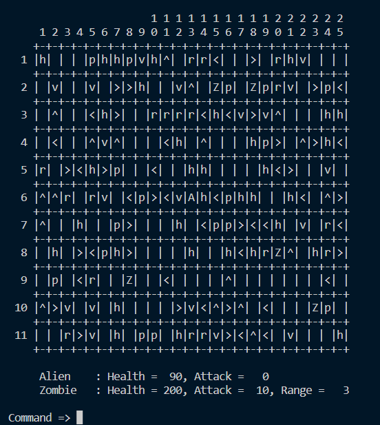

# Alien vs. Zombie

#### Game Introduction


Alien vs Zombie is a game where an alien needs to defeat all zombie in a 2-dimension game board in order to win the game. At the start of the game, the alien will be placed in the middle of the game board while the zombies will be randomly generated. The player can choose to customize the game settings before the game starts. The customizeable settings are, rows and columns of the game board and the number of zombies. In the game there's a few game objects that helps alien to defeat zombies. Such as, health pack, pods, rock. Besides, there's also arrows that changes the direction of alien's movements.

You may add one signature screenshot of your program here or above the title. Check out [this tutorial](https://www.digitalocean.com/community/tutorials/markdown-markdown-images) to learn how to do it.

Please provide the YouTube link to your [Video Demo](https://www.youtube.com/watch?v=pO5W0PhPbMc).

## Compilation Instructions

Provide instructions on how to compile your program, especially when it is non-trivial.
```
1. Open main.cpp
2. Compile the code
```
For example:

```
g++ main.cpp folder1\code.cpp folder2\code.cpp ......
```

## User Manual

Please provide the user manual on how to use your program.

Please DO NOT change the Progress Log below. Leave it as it is.

## Progress Log

- [Part 1](PART1.md)
- [Part 2](PART2.md)

## Contributors

Please replace the following with your group members' names. 

- Wong Ju Wei
- Yap Rui Ern
- Lim Jia Hen


