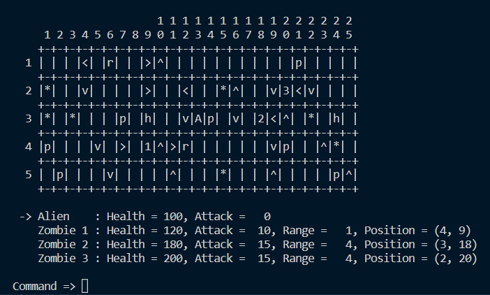

# Alien vs. Zombie

#### Game Introduction


Alien vs Zombie is a game where an alien needs to defeat all zombie in a 2-dimension game board in order to win the game. At the start of the game, the alien will be placed in the middle of the game board while the zombies will be randomly generated. The player can choose to customize the game settings before the game begins. The customizeable settings are difficulty levels, rows and columns of the game board and the number of zombies. In the game there's a few game objects that helps alien to defeat zombies such as, health pack, pods and rock. Health packs adds 20 health points to alien, pods attacks the nearest zombie to it, rock stops alien from moving and drops a game object. Besides, there's also arrows that changes the direction of alien's movements and increases alien's attack by 20. Additionally, we've added a new game object 'spike' which is represented by '*'. It deals damage of 10 to alien when being approached.


Part 1 >> [Youtube link](https://www.youtube.com/watch?v=pO5W0PhPbMc).
Part 2 >> [Youtube link](https://youtu.be/DpwxYc-8l2A).

## Compilation Instructions

Provide instructions on how to compile your program, especially when it is non-trivial.
```
1. Open main.cpp
2. Compile the code (Press F5 / play button) to debug
```

## User Manual

Under the commands there is a few moves that you can perform in the game. 
1. Up - moves alien upwards
2. Down - moves alien downwards
3. Left - moves alien to the left
4. Right - moves alien to the right
5. Arrow - change the arrow's to your desire direction
6. Help - display all commands
7. Save - save current game
8. Load - load saved games
9. Quit - quit game

## Progress Log

- [Part 1](PART1.md)
- [Part 2](PART2.md)

## Contributors

Please replace the following with your group members' names. 

- Wong Ju Wei
- Yap Rui Ern
- Lim Jia Hen


